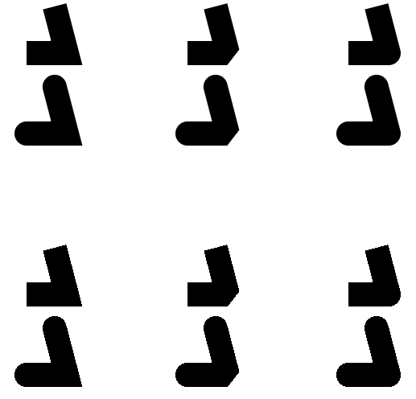

# PixiJS Smooth Graphics
PixiJS v6 plugin for making smooth shapes using HHAA shader.

[](https://github.com/pixijs/graphics-smooth/actions?query=workflow%3A%22Build%22) [](https://badge.fury.io/js/%40pixi%2Fgraphics-smooth)

## Features

This is very early version of the plugin.

Here's how it looks, compared to pixi graphics (antialias=false)



You can find examples in `examples` folder, you have to start the local webserver in repo folder to view them. 

### How to draw lines

This is drop-in replacement of `PIXI.Graphics`, API is compatible.

```js
import { SmoothGraphics as Graphics } from '@pixi/graphics-smooth';

const graphics = new Graphics();

graphics.moveTo(100, 100);
graphics.lineTo(200, 200);
```

### LineScaleMode

For lines, `native` mode is renamed to `scaleMode`, you can ignore scale of element or even set default value for it!

```js
import { SmoothGraphics, LINE_SCALE_MODE, settings } from '@pixi/graphics-smooth';

graphics.lineStyle({ width: 2.0, scaleMode: LINE_SCALE_MODE.NONE }); // now its always 2 independent from scale

//alternatively
settings.LINE_SCALE_MODE = LINE_SCALE_MODE.NONE;

const graphics2 = new SmoothGraphics();
graphics.lineStyle(2.0, 0xffffff, 1.0); //the usual, but scaleMode works by default

settings.LINE_SCALE_MODE = LINE_SCALE_MODE.NORMAL;
graphics.lineStyle(2.0, 0xffffff, 1.0); //its normal again
```

Note: `NONE` was the only option for `graphics-smooth <= 0.0.6`. Please update your code if you used early versions!

### How to draw fills

Fills have a bit of a problem - smoothing works good only on concave objects.
It works only on circles and polygons. It is not implemented for rects and rounded rects yet.  

```js
graphics.beginFill(0xffffff, 1.0, true); //third param for beginFill
```

HHAA doesn't work with texture fill yet.

### drawStar and other graphics-extras

That's what you have to do if you need functions from graphics-extras package: 

```js
import { SmoothGraphics } from '@pixi/graphics-smooth';
import { Graphics } from '@pixi/graphics';
import '@pixi/graphics-extras';

Object.assign(SmoothGraphics.prototype, {
    drawTorus: Graphics.prototype.drawTorus,
    drawChamferRect: Graphics.prototype.drawChamferRect,
    drawFilletRect: Graphics.prototype.drawFilletRect,
    drawRegularPolygon: Graphics.prototype.drawRegularPolygon,
    drawRoundedPolygon: Graphics.prototype.drawRoundedPolygon,
    drawStar: Graphics.prototype.drawStar,
});
```

For UMD:

```js
PIXI.smooth.SmoothGraphics.prototype.drawStar = PIXI.Graphics.prototype.drawStar;
```

### Pixel Perfect

You might notice that for diagonal lines, coverage differs from canvas2d a lot, especially if you do line animations. Solution is easy:

```js
import { settings } from '@pixi/graphics-smooth';
settings.PIXEL_LINE = 1;
```

It has to be done before first GraphicsSmooth is created.

This setting is disabled by default because it adds extra computations in coverage calculation. It is not researched yet how it will affect performance.

### What are we working on

* better AA on fills
* support for line textures
* rope mode for line textures

## Performance

Currently graphics geometry uses 11 floats per vertex, when original graphics used only 8. Number of vertices also differ, it might use up to 2x of original.

Uniforms are used to store styles depends on (lineWidth * scaleMode, lineAlignment, texture, matrix).

If style buffer is too big (for now its max 24), one more drawcall will spawn.

### What are we working on

* support [instancing](https://wwwtyro.net/2019/11/18/instanced-lines.html)
* support Uniform Buffer Objects
* support batching of multiple graphics elements

## Build & test

```bash
npm
npm run build
http-server -c-1
```

Open `examples/simple.html`
